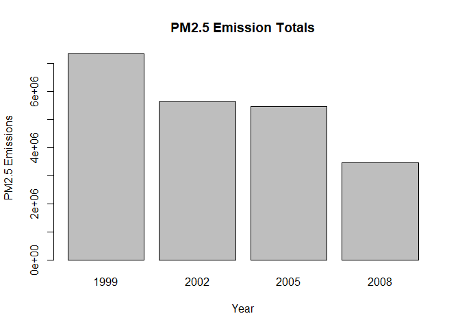
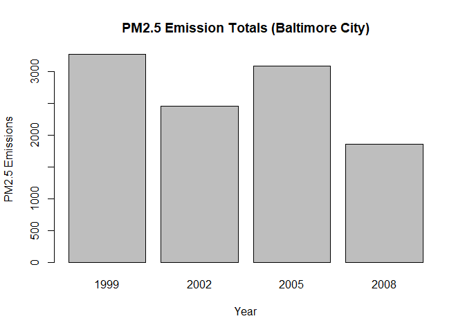
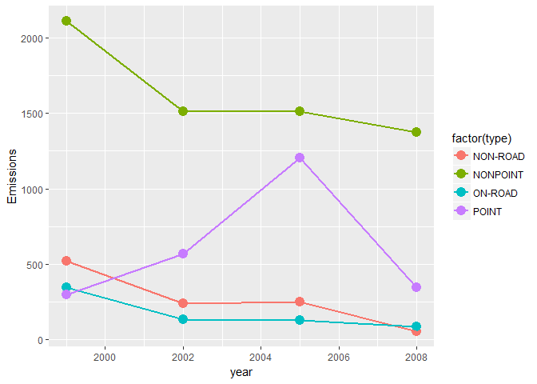
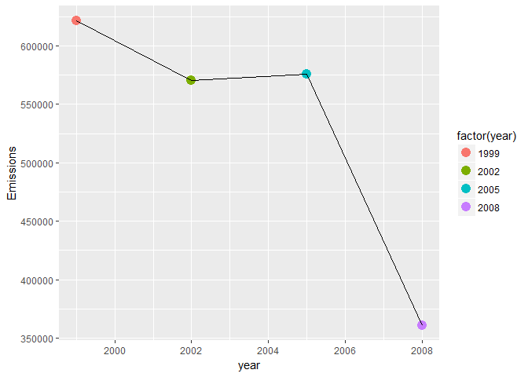
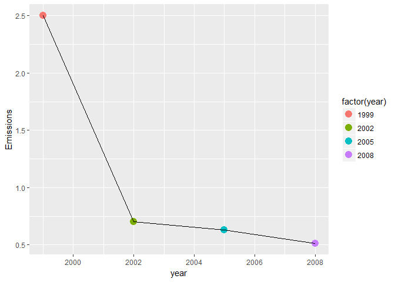
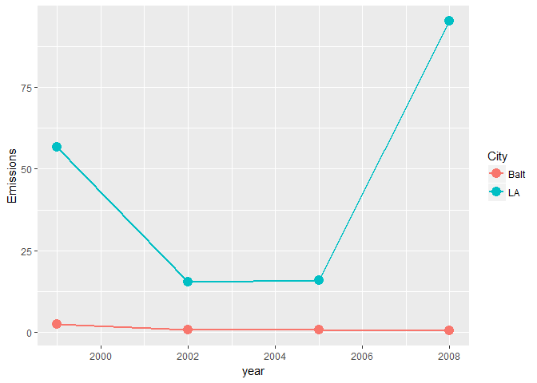

Week 4 Exploratory Data Analysis - Global Active Power
================

Introduction
------------

This is the week 4's assignment for the Coursera course, Exploratory Data Analysis - Global Active Power. 6 plots with their respective R codes have been plotted below.

Loading of Data Set and Library
-------------------------------

``` r
library(ggplot2)
NEI <- readRDS("summarySCC_PM25.rds")
SCC <- readRDS("Source_Classification_Code.rds")
```

Have total emissions from PM2.5 decreased in the United States from 1999 to 2008? Using the base plotting system, make a plot showing the total PM2.5 emission from all sources for each of the years 1999, 2002, 2005, and 2008.
---------------------------------------------------------------------------------------------------------------------------------------------------------------------------------------------------------------------------------

``` r
NEI$SCC <- as.factor(NEI$SCC)
totals <- aggregate(Emissions ~ year,NEI, sum) #summing emissions by SCC and year

barplot(totals$Emissions, ylab = "PM2.5 Emissions", xlab = "Year", names.arg = totals$year, main = "PM2.5 Emission Totals")
```



Have total emissions from PM2.5 decreased in the Baltimore City, Maryland ( 𝚏𝚒𝚙𝚜 == 𝟸𝟺𝟻𝟷𝟶) from 1999 to 2008? Use the base plotting system to make a plot answering this question.
----------------------------------------------------------------------------------------------------------------------------------------------------------------------------------

``` r
NEIsub <- subset(NEI, fips == "24510") #baltimore
totals1 <- aggregate(Emissions ~ year, NEIsub, sum) #summing emissions by SCC and year
barplot(totals1$Emissions, ylab = "PM2.5 Emissions", xlab = "Year", names = totals1$year, 
        main = "PM2.5 Emission Totals (Baltimore City)")
```



Of the four types of sources indicated by the 𝚝𝚢𝚙𝚎 (point, nonpoint, onroad, nonroad) variable, which of these four sources have seen decreases in emissions from 1999–2008 for Baltimore City? Which have seen increases in emissions from 1999–2008? Use the ggplot2 plotting system to make a plot answer this question.
---------------------------------------------------------------------------------------------------------------------------------------------------------------------------------------------------------------------------------------------------------------------------------------------------------------------------

``` r
totals <- aggregate(Emissions ~ type + year, NEIsub, sum) #summing emissions by SCC and year
ggplot(totals, aes(year, Emissions)) + geom_point(aes(colour = factor(type)), size = 4) + geom_line(aes(group = type, colour = type),size = 1)
```



Across the United States, how have emissions from coal combustion-related sources changed from 1999–2008?
---------------------------------------------------------------------------------------------------------

``` r
coal <- SCC[grep("*coal*|*Coal*",SCC$Short.Name),]#extracting all rows with the word coal within the short.name
coalSCC <- coal$SCC #extracting the SCC code for comparison
coalSCC <- as.data.frame(coalSCC)
colnames(coalSCC) <- "SCC"

coaldata <- merge(NEI, coalSCC, by="SCC")
totals <- aggregate(Emissions ~ year, coaldata, sum)
ggplot(totals, aes(x=year, y=Emissions)) + geom_point(aes(colour = factor(year)), size = 4) + geom_line()
```



How have emissions from motor vehicle sources changed from 1999–2008 in Baltimore City?
---------------------------------------------------------------------------------------

``` r
vehicle <- SCC[grep("*vehicle*|*Vehicle*", SCC$Short.Name),]
vehicleSCC <- vehicle$SCC

#extracting motor vehicles in baltimore city only
veh_balt <- NEIsub[NEIsub$SCC %in% vehicleSCC,] #extracting similar entries of vehicleSCC INSIDE NEIsub$SCC, and extracting those rows from NEIsub
agg_veh_balt <- aggregate(Emissions ~ year, veh_balt, mean)

ggplot(agg_veh_balt, aes(x=year, y=Emissions)) + geom_point(aes(colour = factor(year)), size = 4) + geom_line() 
```

 \#\# Across the United States, how have emissions from coal combustion-related sources changed from 1999–2008?

``` r
NEIsubLA <- subset(NEI, fips == "06037") #LA
veh_LA <- NEIsubLA[NEIsubLA$SCC %in% vehicleSCC,] #extracting similar entries of vehicleSCC INSIDE NEIsub$SCC, and extracting those rows from NEIsub
agg_veh_LA <- aggregate(Emissions ~ year, veh_LA, mean)
agg_veh_LA$City <- rep("LA", 4) #adding LA to new col city
agg_veh_balt$City <- "Balt" #same as above but using different method

complabalt <- rbind(agg_veh_balt, agg_veh_LA) #combine 2 dataframes

ggplot(complabalt, aes(x=year, y=Emissions)) + 
  geom_point(aes(colour = City), size = 4) + 
  geom_line(aes(colour = City), size = 1) 
```


